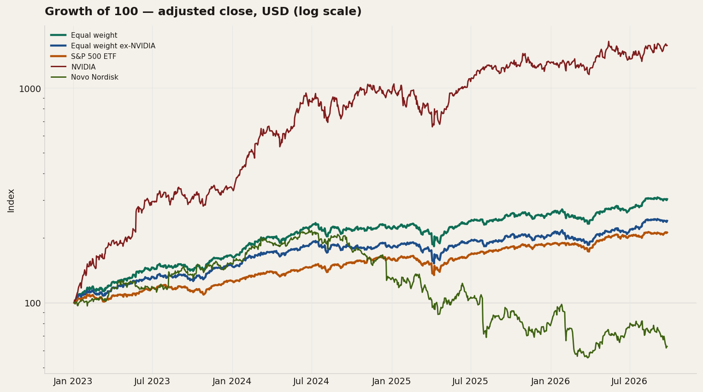
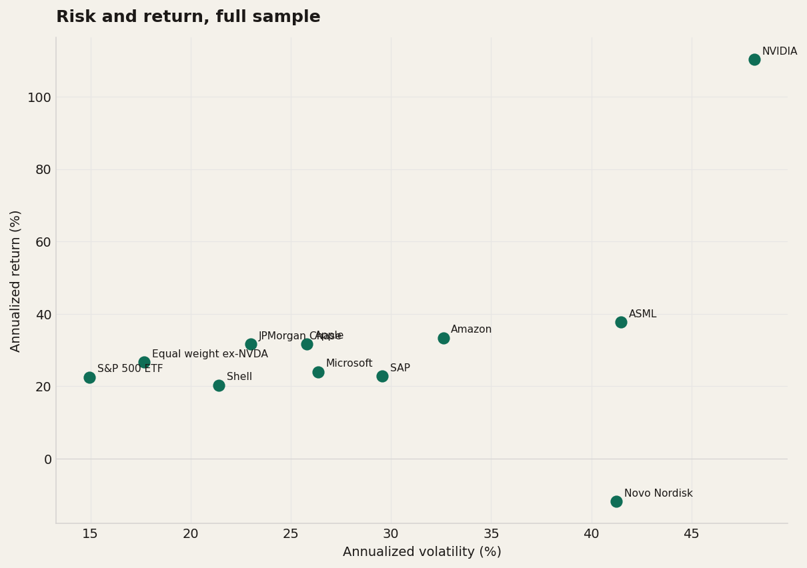
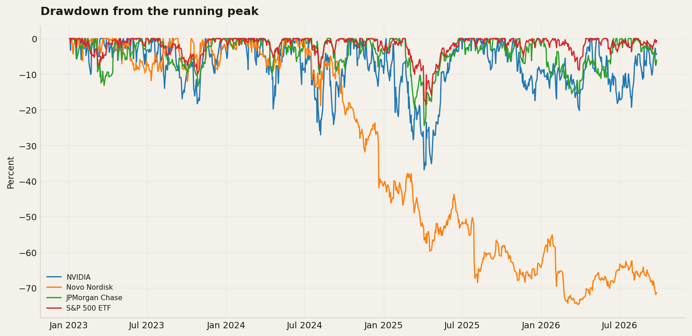
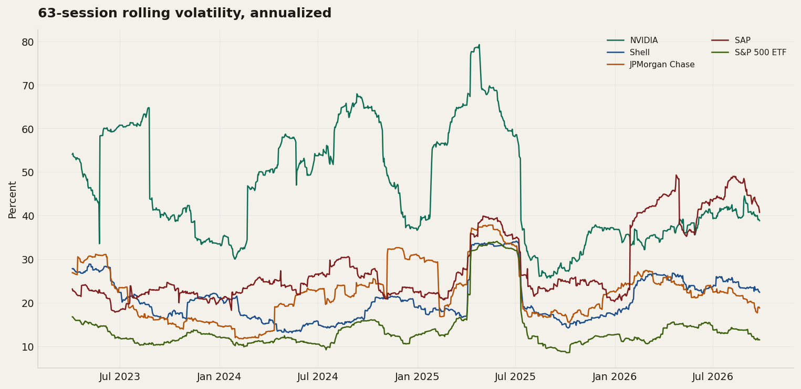
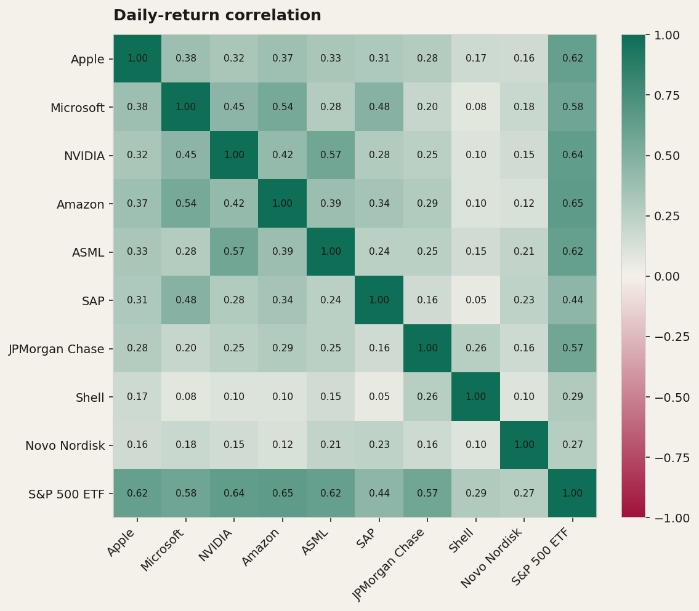
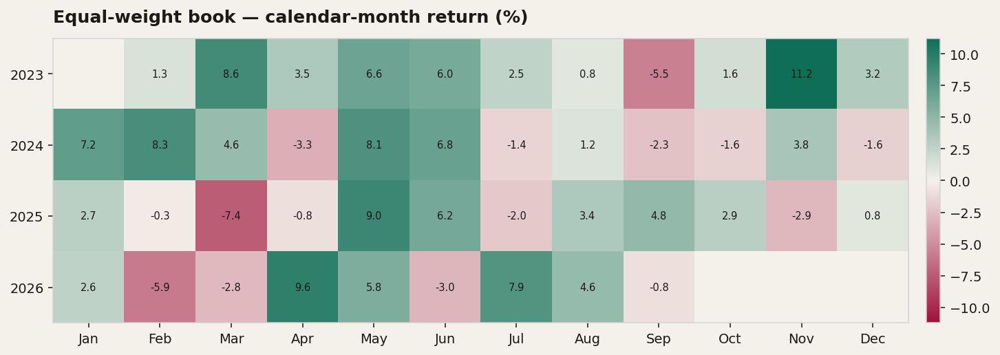

# Equity market analytics

A reproducible look at nine USD-listed stocks against the S&P 500 ETF, from January 2023 through September 2026.

The question is narrow on purpose: **did a monthly-rebalanced equal-weight book beat SPY on return and on risk, and does that answer survive without NVIDIA?**

This is a portfolio project for a working-student application in finance or data. It is not a recommendation and the universe was chosen, not sampled.

## What comes out of the numbers

Sample: **2023-01-03 to 2026-09-25**, 936 shared sessions. Prices are Yahoo Finance **adjusted closes in USD**, so splits and dividends are in the series and European names enter as US listings (ASML, SAP, SHEL, NVO). No FX mix.

Sharpe uses a constant **4%** risk-free rate. The equal-weight book resets to 1/N on the first session of each month and is **gross of costs**.

| Name | Ann. return | Ann. vol | Sharpe | Max DD | Beta | Alpha |
|---|---:|---:|---:|---:|---:|---:|
| Apple | 31.7% | 25.8% | 1.04 | -33.4% | 1.08 | 8.4% |
| Microsoft | 24.0% | 26.4% | 0.80 | -34.5% | 1.02 | 3.3% |
| NVIDIA | 110.3% | 48.1% | 1.70 | -36.9% | 2.06 | 58.2% |
| Amazon | 33.4% | 32.6% | 0.92 | -30.9% | 1.42 | 5.5% |
| ASML | 37.7% | 41.5% | 0.89 | -45.5% | 1.73 | 6.7% |
| SAP | 22.8% | 29.6% | 0.71 | -52.3% | 0.87 | 5.9% |
| JPMorgan Chase | 31.6% | 23.0% | 1.14 | -24.4% | 0.88 | 11.5% |
| Shell | 20.3% | 21.4% | 0.79 | -18.5% | 0.42 | 9.9% |
| Novo Nordisk | -11.9% | 41.2% | -0.19 | -74.7% | 0.75 | -18.9% |
| S&P 500 ETF | 22.5% | 14.9% | 1.17 | -18.8% | — | — |
| Equal-weight book | 34.7% | 19.3% | 1.44 | -22.1% | 1.14 | 8.4% |
| Equal-weight book, ex-NVIDIA | 26.6% | 17.7% | 1.20 | -21.5% | 1.02 | 3.7% |

Reading it:

- The full equal-weight book annualized **34.7%** versus **22.5%** for SPY, Sharpe **1.44** versus **1.17**.
- Take NVIDIA out and the annualized return falls to **26.6%**. The Sharpe gap versus SPY almost disappears (**1.20** vs **1.17**). The headline is one name, not a diversified edge.
- Novo Nordisk is the reminder that a large, liquid name can still draw down **75%** in this window.
- Beta and alpha are an OLS of daily excess returns on SPY. Annualized alpha is not a skill claim. Costs, taxes, and the fact that this list was picked in advance are all outside the regression.













## Method

| Choice | What it means |
|---|---|
| Adjusted close | Yahoo `adjclose`. Price return including dividend adjustments, not a separate dividend cashflow. |
| Inner join on dates | A session is kept only when every name has a print. No forward-fill. |
| USD listings only | ASML, SAP, Shell, and Novo Nordisk are the US lines, so the panel is not a mix of EUR and USD. |
| Equal weight | 1/N at the first session of each month, then weights drift until the next reset. |
| Ex-NVIDIA book | Same rule on the other eight names. This is the robustness check, not a second strategy pitch. |
| Drawdown | Peak-to-trough loss on the price level, not on a hedged residual. |
| Risk-free rate | 4% annual, compounded into a daily rate. It is a round assumption for 2023–2026 T-bills, not a bill index. |

## Run it

Python 3.10+. From this directory:

```bash
pip install -r requirements.txt
python analysis.py            # uses data/prices.csv
python analysis.py --refresh  # downloads adjusted closes again
python -m unittest discover -s tests
```

`data/prices.csv` is checked in so the figures rebuild without a network. `--refresh` hits Yahoo Finance's public chart endpoint.

## Layout

```text
analysis.py                 entry point
market_analytics/metrics.py return, volatility, Sharpe, drawdown, beta, alpha
market_analytics/portfolio.py
market_analytics/download.py
market_analytics/plots.py
tests/test_metrics.py       compounding, drawdown, beta, Sharpe
data/prices.csv
figures/                    svg and png
results/                    table and summary.json
```

## What this does not show

- The nine names are names a desk would actually discuss. They are not a random cross-section, and they are not the S&P 500. Beating SPY with this list is not evidence of a process.
- There are no transaction costs, no taxes, and no position limits. Monthly rebalancing of nine liquid names is cheap, but it is not free, and NVIDIA's spread is not the point — its weight is.
- Alpha versus SPY over a window that contains this NVIDIA path will look large. The ex-NVIDIA column is there so that number is not the last thing in the notebook.
